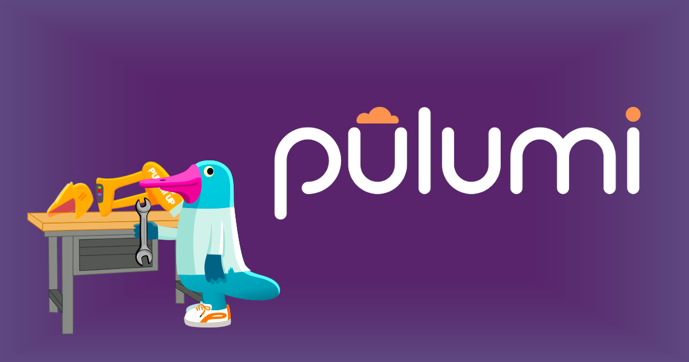

# Chapter 2 - Containerize an Application



## Overview

Having established our Kubernetes cluster, it's time to deploy our application. In this chapter, we'll embark on the
journey of containerizing a basic `node.js` application and subsequently pushing it to a container registry.

It's worth noting that Exoscale currently lacks a native container registry. However, fret not! I'll be furnishing you
with credentials for an external container registry. The Pulumi code we'll delve into not only creates a registry for us
but also builds the image and ensures it's pushed to the designated registry.

## Instructions

### Step 1 - Configure the Pulumi CLI

> If you run Pulumi for the first time, you will be asked to log in. Follow the instructions on the screen to
> login. You may need to create an account first, don't worry it is free.

To initialize a new Pulumi project, run `pulumi new` and select from all the available templates the `typescript`. Of
course, you can use any other language you want.

```bash
pulumi new
```

You will be guided through a wizard to create a new Pulumi project. You can use the following values:

```bash
project name (02-app):
project description (A minimal TypeScript Pulumi program):  
Created project '02-app'

Please enter your desired stack name.
To create a stack in an organization, use the format <org-name>/<stack-name> (e.g. `acmecorp/dev`).
stack name (dev): dev 
...
```

Now you need to add the Docker provider to your project. Depending on the programming language you are using, you need
to follow different steps. Check
the [Pulumi Docker Provider](https://www.pulumi.com/registry/packages/docker/installation-configuration/)
documentation for more information.

I am using `typescript` for this workshop, so I need to install the Exoscale provider with `npm`.

```bash
npm install @pulumi/docker --save-dev
```

Try to use `config` values from the start for following properties:

- `registry`
- `username`
- `password`

for the fields in the `docker.Image` resource.

Please export also the `repoDigest` from your `Image` resource, as we need it later on.

### Step 2 - Pulumi Secret Management: Batteries Included!

Storing passwords directly in our config (and I'm not referring to Pulumi ESC here) is a security misstep. Fortunately,
Pulumi offers solutions to this challenge. While we're already acquainted with Pulumi ESC, there's another robust tool
at our disposal: Pulumi secrets.

Pulumi secrets are an excellent mechanism for safeguarding sensitive data within your Pulumi project. These secrets are
encrypted and securely stored, allowing us to even commit them to our repository without concerns. Pulumi handles the
encryption and decryption processes seamlessly.

To integrate a secret into our project using the Pulumi CLI, follow these steps:

```bash
pulumi config set --secret password
```

And you will be prompted to enter the value for the secret! After you entered the value, you can check the value with

```bash
pulumi config get password
```

Do the same for the `username` as it contains the API key for the container registry.

### Step 3 (Optional) - Test the application

If you want you can run the image locally to see if it works:

```bash
docker run -p 3000:3000 -d <imageName output from pulumi>/myapp:latest
WARNING: The requested image's platform (linux/amd64) does not match the detected host platform (linux/arm64/v8) and no specific platform was requested
Server started on port 3000
```

#### Step 3.1 - Curl the GET endpoint

```bash
curl localhost:3000
```

You should see the following output:

```bash
Hello Pulumi World!
```

#### Step 3.2 - Curl the POST endpoint

```bash
curl -X POST -H "Content-Type: application/json" -d '{"message":"This is a test message"}' http://localhost:3000
```

We expect following output:

```bash
Received message: This is a test message
```

Congratulations! You have successfully containerized an application and pushed it to a container registry. Please leave
the cluster up and running for [Chapter 2 - Deploy an Application](./02-deploy-app.md)

## Stretch Goals

- Can you change the `FROM` image a `cgr.dev/chainguard/node:latest` image, for enhanced security and smaller image
  size?
    * Run `docker scout <imageName output from pulumi>/myapp:latest` before the change
    * Hint: You need to change `ENTRYPOINT [ "node", "app.js" ]` to `ENTRYPOINT [ "/usr/bin/node", "/app/app.js" ]`
    * Run `docker scout <imageName output from pulumi>/myapp:latest` after the change and compare the results
- Can you add `json` support to the application?
- Can you add a `health` endpoint to the application?

## Learn More

- [Pulumi](https://www.pulumi.com/)
- [Docker Pulumi Provider](https://www.pulumi.com/registry/packages/docker/)
