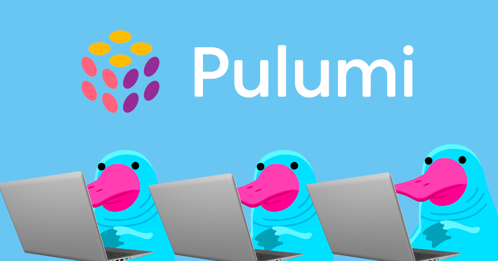

# Chapter 4 - Enter the World of GitOps!



## Overview

In this chapter, we'll pave the way for Argo CD, enabling it to deploy a straightforward application to our Kubernetes
cluster. This application comes equipped with a Helm chart. We'll once again employ `StackReference` to fetch outputs
from our infrastructure stack and programmatically establish a Kubernetes provider.

**New Concepts Introduced:**

- **`Release` Resource**: This will be used to deploy a Helm chart.
- **`CustomResource` Definition**: This will be pivotal in defining an Argo CD `Application`.

For this chapter, I'll be continuing with Go as my programming language of choice. However, always opt for the language
that resonates best with your comfort and proficiency levels.

## Prerequisites

- The Kubernetes cluster from the [previous chapter](/01-sks-cluster-setup.md)
- Pulumi CLI installed
- [Go](https://golang.org/doc/install)
- Fork the https://github.com/dirien/helloserver repository, if you want to change the application
- Optional: Install the [Argo CD CLI](https://argo-cd.readthedocs.io/en/stable/getting_started/#2-download-argo-cd-cli)

## Instructions

### Step 1 - Configure the Pulumi CLI with a new template!

> If you run Pulumi for the first time, you will be asked to log in. Follow the instructions on the screen to
> login. You may need to create an account first, don't worry it is free.

To initialize a new Pulumi project, run `pulumi new`. But this time we're going to use a different template. As I am
going to use Go and do some Kubernetes deployments, I am going to use the `kubernetes-go` template.

There are more pre-defined templates from Pulumi available, check out
the [Pulumi Templates](https://www.pulumi.com/templates/) for more information. You can of course also create your own
templates and share them with your team or organization.

```bash
pulumi new kubernetes-go
```

You will be guided through a wizard to create a new Pulumi project. You can use the following values:

```bash
project name (04-argocd-setup):
project description (A minimal TypeScript Pulumi program):  
Created project '04-argocd-setup'

Please enter your desired stack name.
To create a stack in an organization, use the format <org-name>/<stack-name> (e.g. `acmecorp/dev`).
stack name (dev): dev 
...
```

Please delete the existing `Deployment` resource. We will fill this later with the Argo CD deployment.

As we're going to use the `StackReference` again, we need to set the `infraStackRef` and retrieve our `kubeconfig`. Same
as in the previous chapter.

Check the docs for the [Kubernetes provider](https://www.pulumi.com/registry/packages/kubernetes/) for details about
the `Release` and `CustomResource` resources.

These are the values to fill out for the `Release` resource:

- Chart: `oci://ghcr.io/argoproj/argo-helm/argo-cd`
- Version: `5.46.8`
- Namespace: `argocd`
- Values Override: `{"server.service.type":"LoadBalancer"}`

And these are the values for the `CustomResource`:

- ApiVersion: `argoproj.io/v1alpha1`
- Kind: `Application`
- Name: `hello-server-argocd-app`
- Namespace: `argocd` same as the `Release` resource, use the reference to the `Namespace` property from the `Release`
  resource.
- OtherFields:

```yaml
spec:
  project: default
  source:
    repoURL: 'https://github.com/dirien/helloserver'
    path: ./delivery/charts/hello-server
    targetRevision: HEAD
    helm:
      valuesObject:
        service:
          type: LoadBalancer
  destination:
    server: 'https://kubernetes.default.svc'
    namespace: hello-server
  syncPolicy:
    automated:
      prune: true
      selfHeal: true
    syncOptions:
    - CreateNamespace=true
```

Now we can deploy the stack. Run `pulumi up` to deploy the stack.

To see if everything is deployed correctly, you can check the Argo CD UI. To access the UI, you need to port-forward the
service.

```bash
kubectl -n argocd get secret argocd-initial-admin-secret -o jsonpath="{.data.password}" | base64 -d
kubectl get svc -n argocd
kubectl port-forward service/argocd-<hash>-server -n argocd 8080:443`
```

Open the browser and navigate to `https://localhost:8080`. Use the username `admin` and the password you retrieved with
the `kubectl` command.

You should see a tile with the name `hello-server-argocd-app` and the status `Healthy`.

### Step 2 - Change the default value of the Helm chart

If you forked the `https://github.com/dirien/helloserver`, you can change the default `tag` value in `
/helloserver/delivery/charts/hello-server/values.yaml` to `v0.1.1` and commit the change.

Now the GitOps pipeline should deploy the new version of the application, you can either wait for the next sync or use
the Argo CD UI to trigger a sync.

## Stretch Goals

- Can you deploy a second helm chart to the cluster?
- What happens if you delete a Kubernetes resource from the UI in the `hello-server` namespace?

## Learn More

- [Pulumi](https://www.pulumi.com/)
- [Kubernetes Pulumi Provider](https://www.pulumi.com/registry/packages/kubernetes/)
- [Argo CD](https://argoproj.github.io/argo-cd/)
