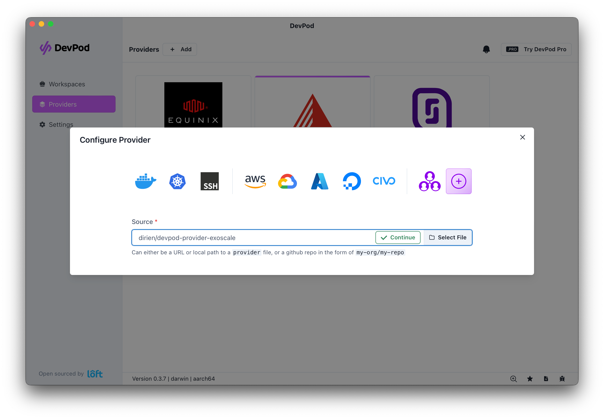

# Pulumi Workshop: Foundations to Advanced

## Welcome, Pulumi and Exoscale Friends! 👋

The goal of this workshop is for you to learn how to use Pulumi in different scenarios. From running instances and
managed service to Kubernetes and GitOps. The workshop is split in multiple chapters showing you the different aspects
of Pulumi. As a bonus, you will learn how to use [Exoscale](https://www.exoscale.com/).

### Repository

You can find the repository for this workshop [here](https://github.com/dirien/pulumi-exoscale-workshop). Please feel
free to look for the examples in the different chapters if you get stuck.

### Content

- [Chapter 0 - Hello, Exoscale World!](./00-hello-exoscale-world.md)
- [Chapter 1 - Welcome, SKS!](./01-sks-cluster-setup.md)
- [Chapter 2 - Containerize an Application](./02-app.md)
- [Chapter 3 - Deploy the Application to Kubernetes](./03-simple-deploy-app.md)
- [Chapter 4 - Enter the World of GitOps!](./04-argocd-setup.md)
- [Chapter 5 - Housekeeping!](./05-housekeeping.md)

### Prerequisites

You will need to install these tools in order to complete this workshop:

- [Pulumi](https://www.pulumi.com/docs/get-started/install/)
- [Pulumi Account](https://app.pulumi.com/signup) - this optional, but convenient to handle the state of the different
  stacks.
- [node.js](https://nodejs.org/en/download/)
- [Go](https://golang.org/doc/install)
- [Python](https://www.python.org/downloads/)
- [Exoscle CLI](https://community.exoscale.com/documentation/tools/exoscale-command-line-interface/)
- [Docker](https://docs.docker.com/get-docker/)
- [kubectl](https://kubernetes.io/docs/tasks/tools/)
- [A GitHub Account](https://github.com/signup)
- [Helm](https://helm.sh/docs/intro/install/)

There is also a [devcontainer.json](.devcontainer/devcontainer.json) file in this repository which you can use to spin
up a `devcontainer` with all the tools installed. Highly recommended if you are
using [VSCode](https://code.visualstudio.com/docs/devcontainers/containers), [GitHub Codespaces](https://docs.github.com/en/codespaces/overview)
or
[DevPods](https://devpod.sh).

### Install DevPod and the Exosacle DevPod provider

The best results you will get if you use [DevPods](https://devpod.sh) to run this workshop. After the installation go
ahead and install the [Exoscale DevPod provider](https://github.com/dirien/devpod-provider-exoscale)

Click on `Providers` -> `Add` -> `Custom` and enter `dirien/devpod-provider-exoscale` into the `Source` field. Click on

Click on `Continue` to enter the provider configuration. Enter your Exoscale API key and secret key. Keep the rest as
it.

Now you can add a new workspace by clicking on `Workspaces` -> `+ Create` and
enter `github.com/dirien/pulumi-exoscale-workshop` in the `Enter Workspace Source and click `Create Workspace`.

### Troubleshooting Tips

If you encounter any challenges during the workshops, consider the following steps in order:

1. Don't hesitate to reach out to me! I'm always here to assist and get you back on track.
1. Review the example code available [here](https://github.com/dirien/pulumi-exoscale-workshop).
1. Search for the error on Google. Honestly, this method often provides the most insightful solutions.
1. Engage with the Pulumi Community on Slack. If you haven't joined yet, you can do
   so [here](https://slack.pulumi.com/).

### Want to know more?

If you enjoyed this workshop, please some of Pulumi's other [learning materials](https://www.pulumi.com/learn/)
